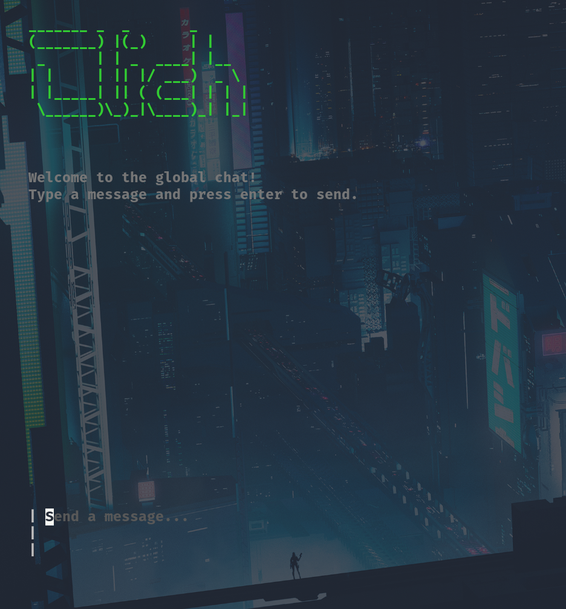
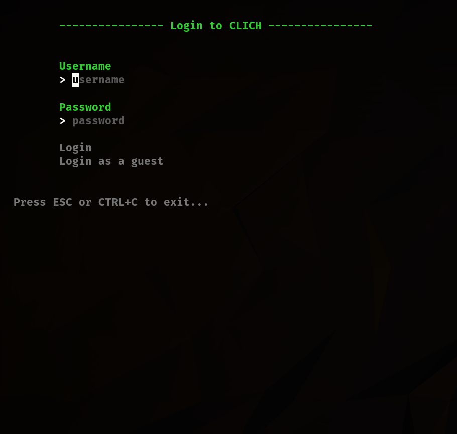

# CLI Chat application in Go

A chat application in Go, where your terminal serves as the interface! The project is mainly for fun and learning. It's also a work in progress.

## Implemented

- Bubbletea frontend UI base (Used the example from their github for starting the project out, so I can test my backend which I am focusing on first. I'm planning to customize the UI a lot later on)
- Basic websocket server
- Some basic functionality implemented:
  - Messages of the connected clients are rendered into the UI

## Working on (Core functionalities):
  - Refactoring the code and returning functionality after moving to multirepo architecture. 

## Tech stack:
- Go for frontend and backend
- Charmbracelet/bubbletea CLI frontend
- Websockets + Protobuf communication (Protobuf to be implemented)

